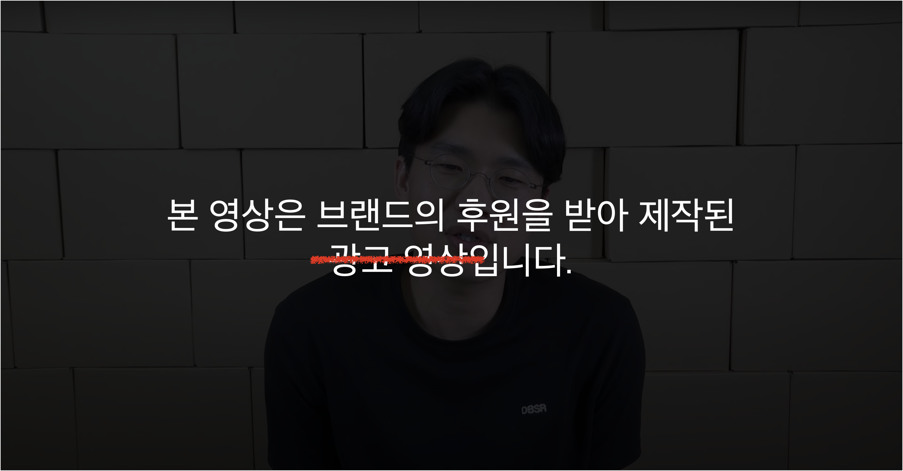
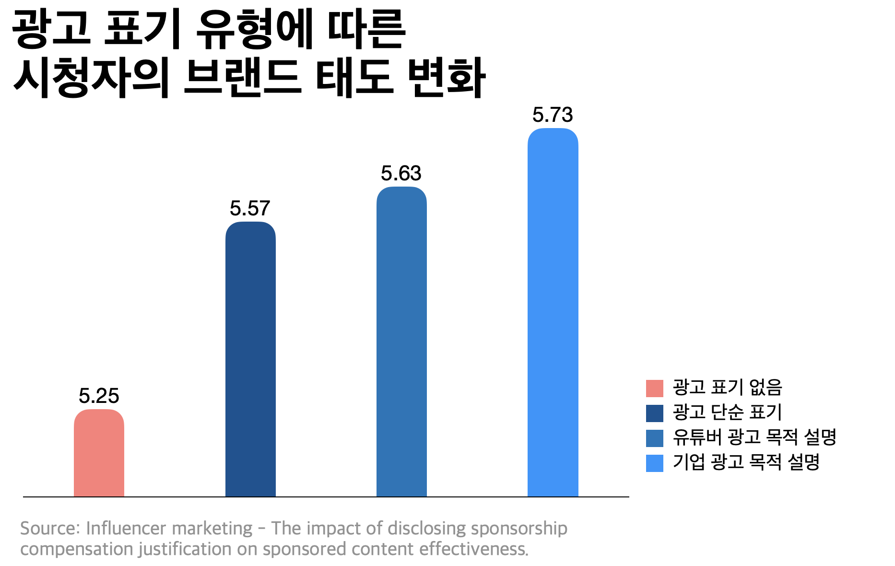
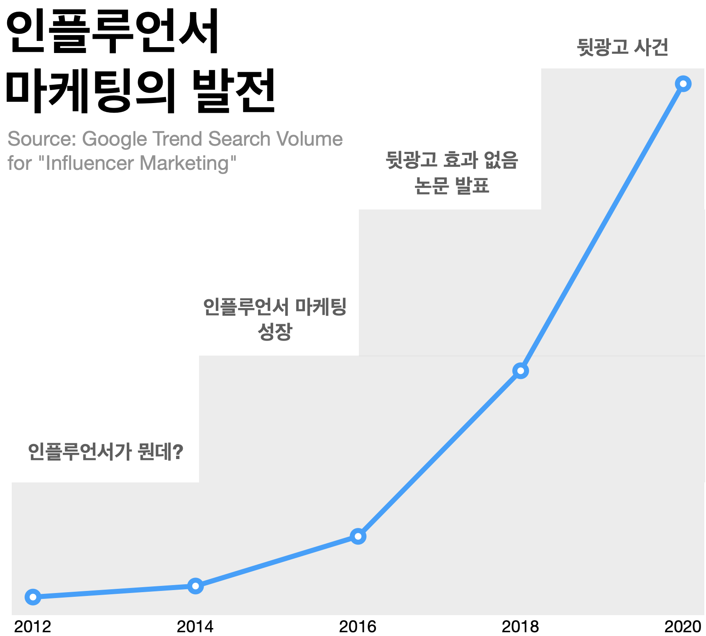
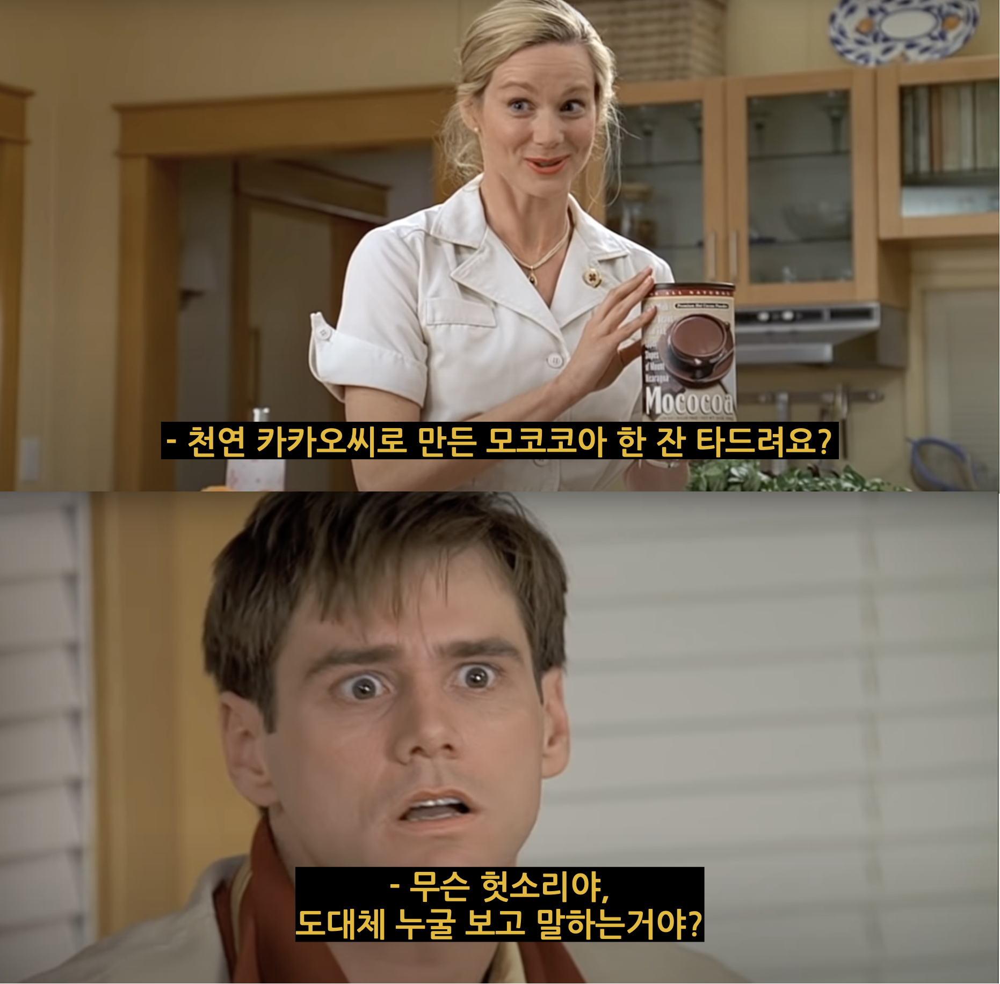
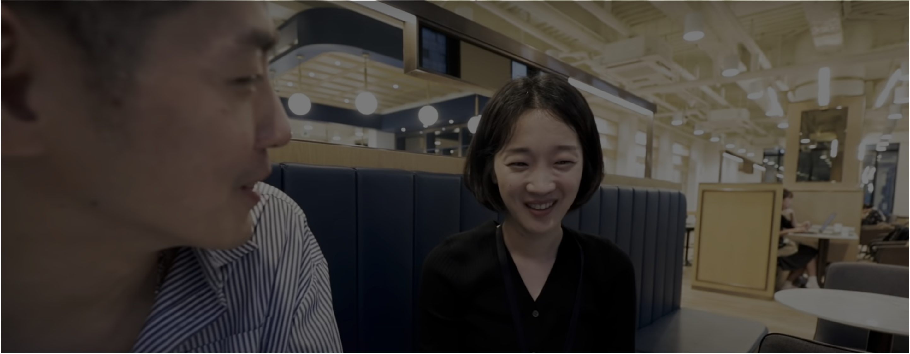

## 인플루언서 마케팅의 오해와 진실 - 유튜버 뒷광고

### 00. 돈만 밝히는 더러운 유튜버 개XX들

지난 8월 유튜버 *참PD*는 100만 이상의 대형 유튜버들 중 대부분이 기업으로부터 돈을 받는다고 폭로했다. 
문제는 뒷광고다.
광고의 대가를 받았음에도 그들은 광고 표시를 하지 않거나 광고가 아니라고 부정했다.
뒷광고에 대한 시청자의 분노는 거셌다. 

뒷광고는 유튜브 전에도 흔이 있던 일이다. 
네이버 블로그에서 만연한 뒷광고는 검색의 신뢰도를 저하했다.
공중파 방송도 마찬가지다. 맛집 프로그램이 가게로부터 사례금을 받는 것은 공공연한 사실이다.
어느 플랫폼에서든 뒷광고는 있다. 
하지만 뒷광고 유튜버를 향한 손가락질은 유난히 날카롭다

시청자의 격한 분노의 이유는 무엇일까?
뒷광고를 다룬 나무위키 문서는 시청자의 분노에 대한 언급을 하며 링크를 달았다, '[강약약강](나무위키).'
유튜버는 시청자에게 을의 입장이기 때문이라는 것이다. 도를 넘는 악플러를 보면 일리 있는 설명이다.
하지만 시청자의 갑질과 극성 악플러의 소행은 유튜브의 보편적인 모습이지 뒷광고에서만 보이는 건 아니다.

뒷광고에 대한 시청자의 분노를 살펴보면 인플루언서 마케팅을 시청자가 어떻게 받아들이는 지 알 수 있다.
유튜버 뒷광고 사건을 파헤치며 인플루언서 마케팅에 대한 오해와 진실을 알아보자.

### 01. 뒷광고는 효과적이다?

시청자의 첫 번째 분노 포인트는 유튜버가 시청자를 속였다는 데 있다.
기업으로부터 돈을 받는 광고임에도 유튜버는 이를 부정하거나 은밀하게 숨겼다.
구독자가 400만이 넘었던 유튜버 *보겸*은 치킨 먹방으로 유명하다.
그는 *BBQ 치킨*과 *치요남*의 광고 영상에서 내돈내산을 표방하며 부정한 방식으로 광고했다.

보겸은 왜 뒷광고를 했을까?
일반적으로 뒷광고가 일반 광고보다 더 효과적이라고 생각한다.
시청자가 광고인지 모를 때 유튜버가 홍보하는 상품을 자연스럽게 구매하게 될 거라는 가정이다.
뒷광고에는 속임수가 정직한 것보다 더 낫다는 생각이 깔려있다. 정말 그럴까?

결론부터 말하면, 아니다.
2020년 [Jounrnal of Comunication Management](https://www.emeraldgrouppublishing.com/journal/jcom?distinct_id=176222eec81d63-0762528b34e4958-48183101-13c680-176222eec82896&_ga=2.257544072.222346954.1606891270-513127631.1606891270#editorial-team) 게재된 논문[^1]은 광고 표시 영상에 대한 흥미로운 연구 결과를 보여준다. 
광고라고 표기했을 때 시청자의 기업에 대한 태도가 조금 높아졌으나 이 둘의 차이는 통계적으로 유의하지 않다.
다시 말해, 별 차이 없다.

광고 표시에 따른 광고 효과는 이미 여러차례 논문의 주제로 다뤄졌다.
광고 표시 여부는 광고 태도와 구매 의도에 상관 관계가 없었다[^2].
인스타그램에서도 같은 결과가 나타난다[^3].
뒷광고가 더 효과적일 거라는 일반적인 생각과 반대되는 연구결과다. 

이는 인플루언서 마케팅이 보편화 됐기 때문이다.
뒷광고는 시청자의 광고인식을 피해가려는 시도다.
그러나 '내돈내산'이라는 키워드에서 드러나듯이 유튜버를 이용한 인플루언서 마케팅은 시청자에게 더이상 새로운 유형이 아니다.
따라서 시청자는 유튜버가 상품을 홍보하면 광고라고 추론한다.
반면 익숙한 광고 스토리를 갖는 영상이 광고 표기가 없을때 부정적으로 반응한다.
**브랜드 태도, 광고 태도 뿐만 아니라 유튜버의 신뢰도에도 나쁜 결과로 이어진다.**
속임수는 정직보다 효과적인 전략이 아니다. 

### 02. 광고하는 유튜버는 믿을 수 없다?

뒷광고의 또 다른 이유는 시청자의 광고에 대한 거부 반응이다.
광고에 대한 높은 거부감은 유튜브의 플랫폼 특징이다.
인스타그램, 페이스북과 같은 다른 플랫폼보다 유튜브에서 시청자는 광고 거부 점수가 더 높다[^4]. 

따라서 유튜버에게 광고 표기는 꺼려지는 일이었다.
광고가 자신의 진실된 이미지를 해친다고 생각하기 때문이다.
유튜버 보겸은 60계 치킨과의 협업 광고에서 "**형은 숙제같은 거 안 한다**"라고 말하기도 했다.

보겸의 생각과 달리 진실된 이미지는 광고를 피하거나 부정한다고 얻을 수 있는 게 아니다.
반대로 유튜버는 시청자와 기업 사이에서 겪는 문제를 있는 그대로 드러내야 한다. 광고 영상에서 유튜버나 기업이 협업의 이유와 목적을 설명하면 유튜버에 대한 신뢰도는  시청자의 신뢰도는 상승한다. 브랜드 태도도 높아진다(통계적으로 유의함).

이는 인플루언서 마케팅에서 나타나는 시청자와 유튜버의 관계 때문이다.
구미디어와 달리 유튜브와 같은 뉴미디어에서 시청자와 유튜버는 동등한 위치에 있다.
왜냐하면 '누구든 유튜버가 될 수 있기' 때문이다.
또한 시청자는 원하는 만큼 채널을 돌려 다른 유튜버의 영상을 볼 수 있다. 

따라서 시청자는 유튜버의 광고를 적극적으로 수용할 수도 거부할 수도 있다.
유튜브 앞의 시청자는 바보 상자 TV 앞의 어린아이가 아니다. 
광고 상품과 콘텐츠에 대한 정보를 검색하여 비교 판단한다.
심지어 잘못된 정보가 있다면 유튜버에게 이를 알리고 수정하게 만든다. 

뒷광고는 무의식 중에 광고를 우겨 넣는 구미디어의 방식을 뉴미디어인 유튜브에 적용한 멍청한 시도다.
광고를 주입할 때 유튜버는 배우가 되고 시청자는 관람객이 된다.
어떠한 사전 정보나 맥락 없이 등장하는 광고는 시청자를 혼란스럽게 만들 뿐이다.
영화 트루먼쇼에서 트루먼은 허공을 보며 코코아의 장점을 늘어놓는 자신의 아내를 보며 화를 낸다.
그럼에도 불구하고 그녀의 시선은 카메라에 고정되어 있다. 

뒷광고를 보는 시청자는 트루먼과 같은 입장에 처한다.
**뒷광고는 유튜버와 구독자 사이의 동등한 관계를 무너뜨린다.**
유튜버는 광고 배우가 되고 시청자는 자신도 모르게 광고 타겟이 된다.
원하지도 않는 공연을 봐야하는 관람객에게 무대가 절대 즐거울리 없다.

보겸은 복귀 후에 자신의 중학생 팬에게 묻는다.
"내가 무슨 콘텐츠를 했으면 좋겠어?" 팬은 답한다.
"그냥 형의 솔직한 모습을 보여주세요."
시청자는 광고 배우가 아닌 유튜버를 보기 위해 그의 채널을 찾는다.
속임수는 정직보다 효과적인 전략이 아니다.

### 03. 진정성을 브랜딩하라

기업에게만큼 유튜버에게도 진정성은 가치 있는 이미지다.
유튜버의 속성 중에 유일하게 진정성이 콘텐츠 태도와 제품 태도 모두와 연관을 가진다[^5].
시청자에게 진정성 있다고 받아들여지는 유튜버가 광고 콘텐츠를 만들 때, 시청자는 콘텐츠 뿐만 아니라 제품에도 호의적이라는 말이다. 

그러나 진정성은 감정과 태도의 영역이 아니다.
광고를 안 한다고, 또는 안 하는 척 한다고 진정성있는 유튜버가 되는 게 아니다.
매일 '여러분 덕분입니다'라고 말하며 자신의 성공을 시청자에게 빚진 사람처럼 구는 것이 진실된 태도가 아니다.
오히려 진정성은 **자신의 재능과 노력에 적합한 가격을 매기는 것**을 통해 얻을 수 있다. 

#### 온라인 소비상(Consumable Online Identity) 만들기

진정성 브랜딩의 첫 번째 전략은 적절한 온라인 소비상(Consumable Online Identity)을 만드는 것이다.
온라인 소비상이란 시청자가 유튜버와 같은 인플루언서를 자신의 소비를 위한 실험 모델로 사용하는 것을 말한다. 

유튜브는 유튜버의 시선을 그대로 보여주는 플랫폼이다.
유튜버로서 청렴결백을 모토로 내돈내산만을 고집하며 시청자에게 완벽히 객관적인 정보를 제공하려는 태도는... 바람직하지만 유튜버보다 기자에 가깝다.
시청자가 유튜버에게 바라는 것은 그만의 독특한 시선이다.
똑같은 IT 유튜버라고 해도 제품의 스펙을 중요시하는 잇섭과 마감과 디자인의 완성도에 집착하는 가전주부는 차이가 있다.
이처럼 정보의 객관성 외에도 유튜버의 세련된 취향은 브랜드 태도나 구매 의사에 있어 중요한 역할을 한다. 

브이로거 유튜버 런업은 훌륭한 온라인 소비상의 사례다.
런업의 영상은 제품을 리뷰와 토픽에 따른 브이로그였다.
그런데 정작 시청자의 관심을 끈 것은 그의 패션이었다.
40대로 보이지 않는 그의 동안 비결, 안경 브랜드, 옷 정보를 궁금해했다.
런업은 이를 캐치하고 시니어 라이프스타일을 다루는 유튜버로서 발전했다.
특히 패션에 있어 가격보다는 완성도와 패션 철학이 있는 브랜드를 소개한다.
이로서 20대에게는 '따라하고 싶은 형', 3040대에게는 '세련된 취향을 가진 유튜버'로 자리잡을 수 있었다. 

#### 광고에 대한 메타 정보 제공

진정성 브랜딩의 두 번째 방법은 광고에 대한 열린 정보를 제공하는 것이다.
인플루언서 마케팅에서 시청자는 광고 대상이 아니라 능동적인 참여자여야 한다.
광고 속 이야기 뿐만 아니라 광고 외부의 정보까지 제공하는 것은 시청자가 참여자로서 활동하기 위한 더 넓은 무대를 마련하는 방법이다. 

예를 들어 런업은 광고 콘텐츠를 진행할 때 외부 인사를 등장시킨다.
패스트파이브, IWC 등 협찬한 브랜드의 매니저가 영상에서 런업과 협업을 원하는 이유와 광고에서 기대하는 바를 말한다.
카메라는 런업의 시선에서 광고주를 비침으로써 마치 시청자가 런업과 같이 그의 말을 듣는 듯한 구도를 만든다.

의도적으로 광고 밖의 이야기를 말하는 것은 예술 기법인 '낯설게하기'의 효과를 준다.
시청자에게 이것이 광고라는 것을 명확히 인지시킴으로써 시청자를 광고 수용자가 아니라 참여자로 만든다.
광고주-유튜버-시청자의 관계는 수직적이지 않고 삼각구도로 평등해진다.
이러한 구도에 시청자는 적극적인 행동을 할 수 있고 유튜버의 채널로서의 신뢰도는 상승한다.

> 구시대적인 마케팅은 아직도 소비자를 수동적인 대상으로 취급한다. 그러나 소비자는 끊임없이 움직이고 활동하고 변화하고 상호작용한다. 가만히 있는 과녁을 맞추는 타겟팅은 느리다. 소비자를 주체로서 대응하는 마케팅이 필요하다. _ 현업 마케터 오훙 낌

**진정성은 유튜버의 사회 문화적 자본을 실질적인 수익 구조로 만드는 다리 역할을 한다.**
있으면 좋고 없으면 욕먹는 도덕 규범이 아니라 수익을 위한 브랜딩의 영역이다.
자신의 채널에 적합한 온라인 소비상을 만들고 광고 외부 정보를 의도적으로 공개함으로써 기업과 시청자 사이에서 진정성 있는 유튜버의 입지를 지킬 수 있다.
따라서, 속임수는 정직보다 효과적인 전략이 아니다. 

### 뒷광고 유튜버는 돈을 받고 즐거움을 팔았다

진정성은 돈이 된다.
'돈만 밝히는 더러운 유튜버 개XX들'이 되지 않기 위해서 오로지 콘텐츠만을 생각하는 순수한 아티스트가 될 필요는 없다.
콘텐츠를 만들고 시청자와 공유하는 노력에 대한 정당한 대가를 받는 것은 모두에게 좋은 일이다.
광고 시스템 덕분에 다양한 크리에이터가 유튜브에서 활동할 수 있는 것처럼 말이다.

유튜버는 진정성을 통하여 즐거움을 돈으로 만든다.
따라서 자신이 좋아하는 것을 많은 사람과 공유하며 즐거워하는 능력은 유튜버에게 본질적이다.
유튜버로서 즐겁기 위해서는 시청자를 즐겁게 만들어야하고, 반대로 시청자를 즐겁게 하기 위해서는 자신이 먼저 즐거워해야 한다.
유튜버는 전문적으로 즐거워하는 사람이어야 한다.

> "정말 자기가 하고 싶고, 즐기고, 이 일을 사랑하는 분에게는 유튜브는 블루오션입니다. 그러나 (그렇지 않은 분들에게는) 정말 힘들고 내 주변에 남는 게 아무 것도 없는 도전이 될 겁니다."  _ 구독자 100만 시절의 보겸, 유튜버를 꿈꾸는 이들에게 하는 조언 영상에서

'돈만 밝히는 더러운 유튜버 개XX들'은 시청자에게 가짜 즐거움을 제공하고 이득을 취했다.
왜냐하면 그들은 즐거워하는 능력을 잃었기 때문이다.
즐거움은 유튜브의 원칙이자 목표, 그리고 자본이다.
즐거움이란 자본을 생산할 능력을 잃은 유튜버는 부정한 방식에 손을 댄다.
뒷광고 유튜버는 기업 광고를 통해서, 먹방 유튜버는 음식을 먹고 뱉는 것으로, 거짓말로 콘텐츠를 만드는 '주작'은 흔한 일이다. 

시청자와 함께 즐거워하는 능력을 잃은 유튜버는 돈으로 즐거움을 만들어 판다.
부당거래에 대한 시청자의 분노는 정당하다.

***
[^1]: Stubb, Carolina & Nyström, Anna-Greta & Colliander, Jonas. (2019). Influencer marketing: The impact of disclosing sponsorship compensation justification on sponsored content effectiveness. Journal of Communication Management. 23. 10.1108/JCOM-11-2018-0119.
[^2]: 김은재, 황상재. (2019). 인플루언서 마케팅에서 정보원 유형과 경제적 대가 표시에 따른 광고 효과 연구. 한국디지털콘텐츠학회 논문지, 20(2), 297-306.
[^3]:  Nathaniel J. Evans , Dr. Joe Phua , Jay Lim & Hyoyeun Jun (2017): Disclosing Instagram Influencer Advertising: The Effects of Disclosure Language on Advertising Recognition, Attitudes, and Behavioral Intent, Journal of Interactive Advertising
[^4]: 변혜민(Byeon, Hye Min), 심성욱(Shim, Sung Wook). (2020). 소셜미디어 플랫폼에 따른 인게이지먼트와 광고 인게이지먼트의 관계 : 인스타그램, 페이스북, 유튜브 비교를 중심으로. 광고PR실학연구, 13(2): 58-90
[^5]: 이맹탁, 이준영, 심성욱. (2020). 유튜브(YouTube) 뷰티 인플루언서 속성이 콘텐츠 태도, 제품 태도, 구전의도, 구매의도에 미치는 영향 연구. 광고학연구:제31권 5호(2020년)