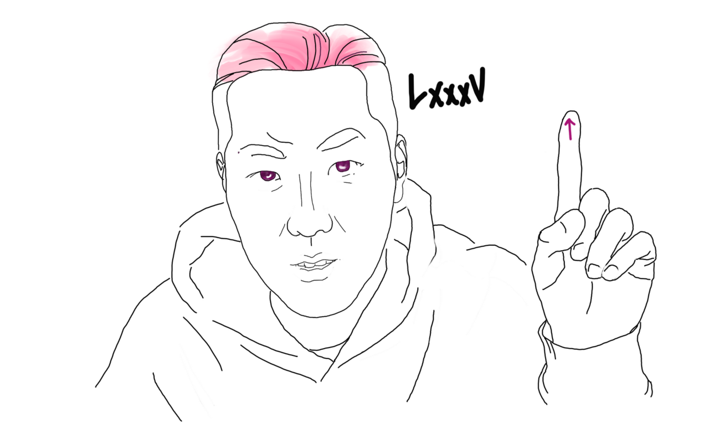
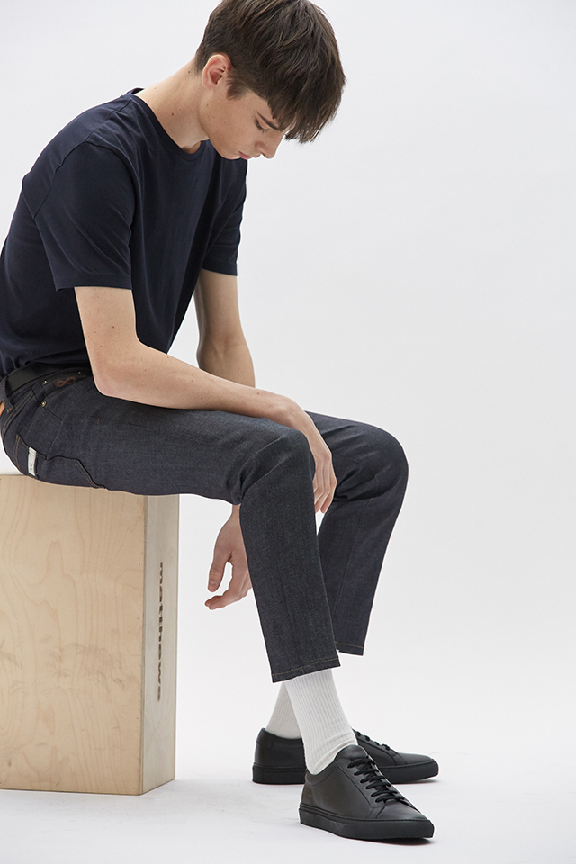
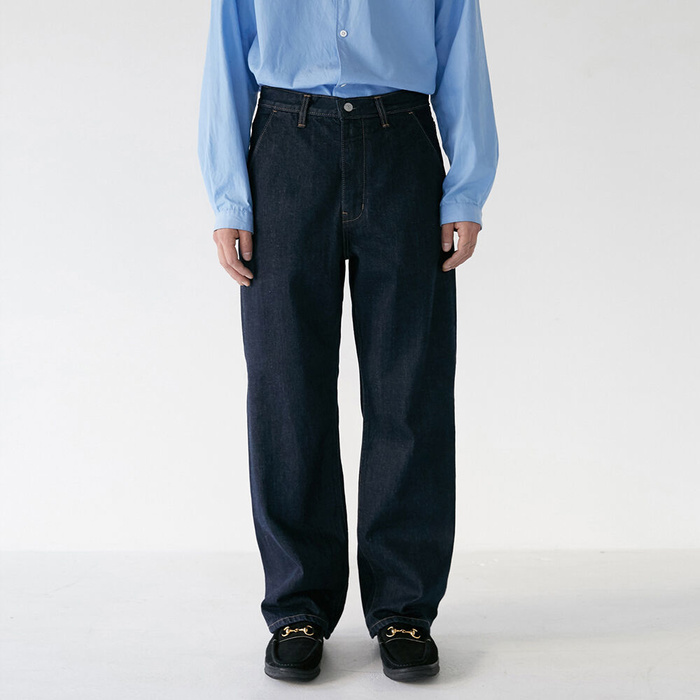
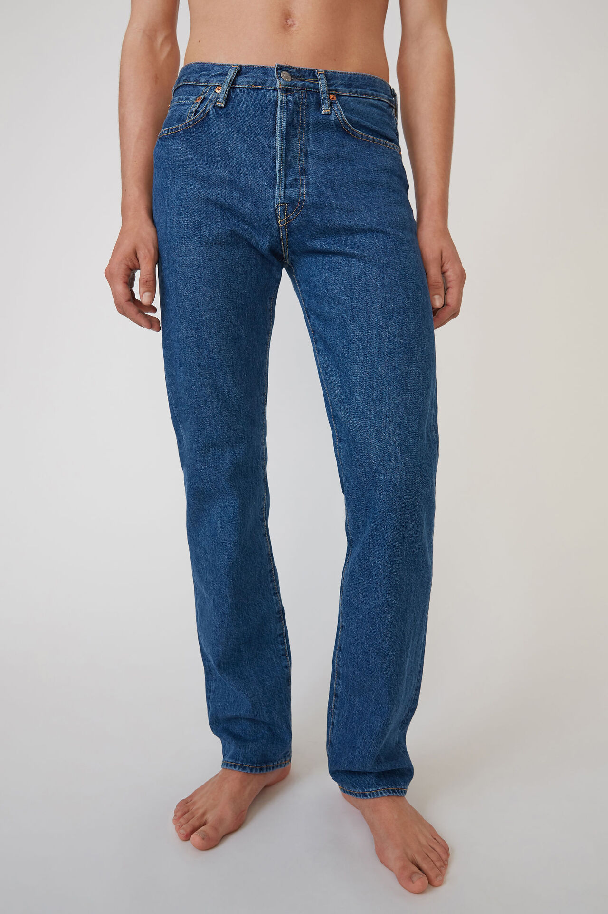
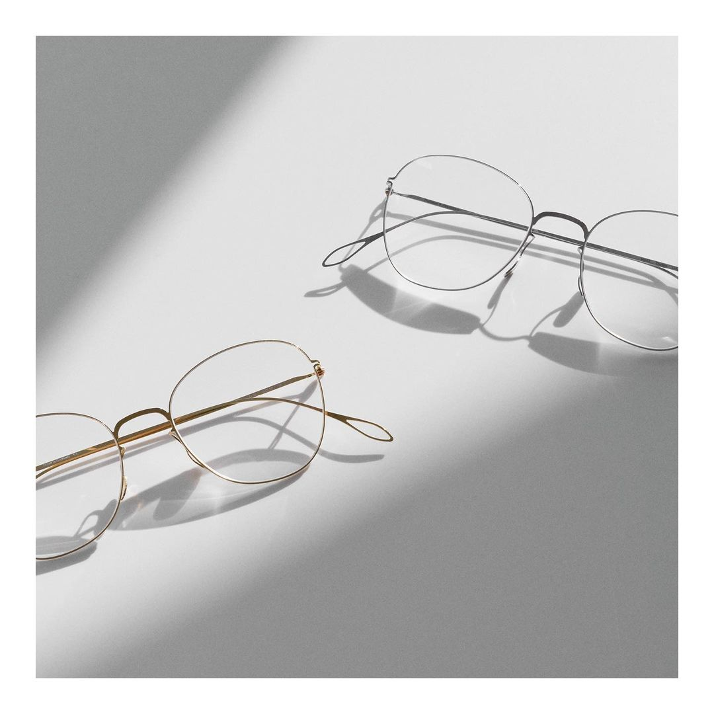
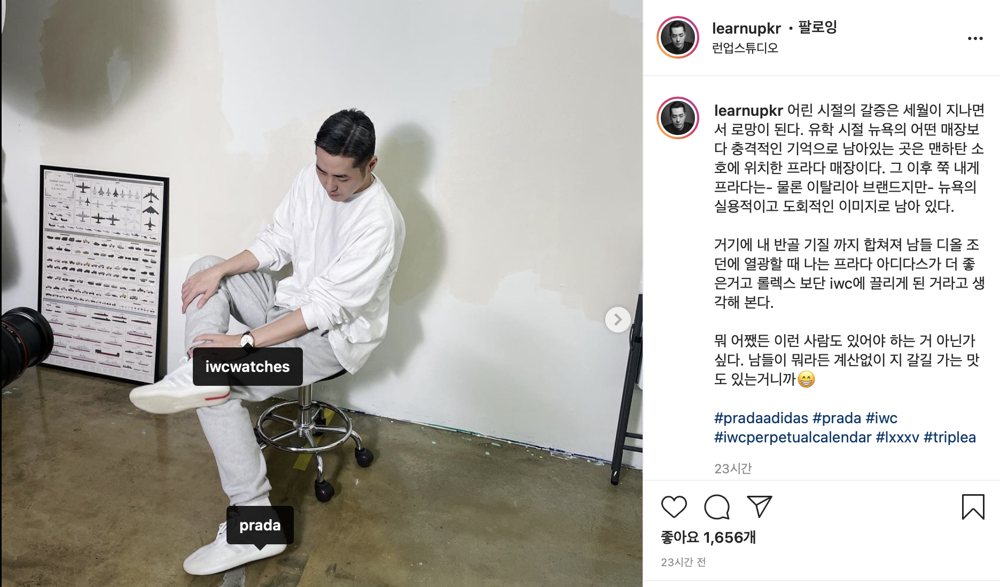
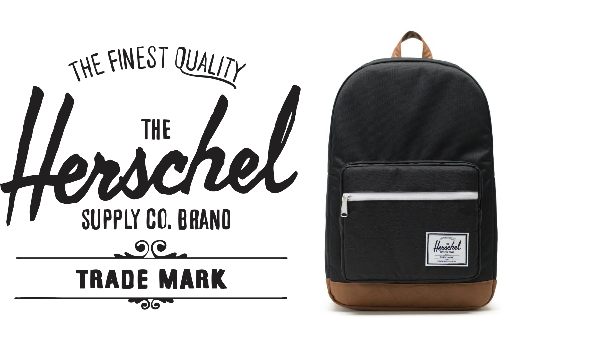
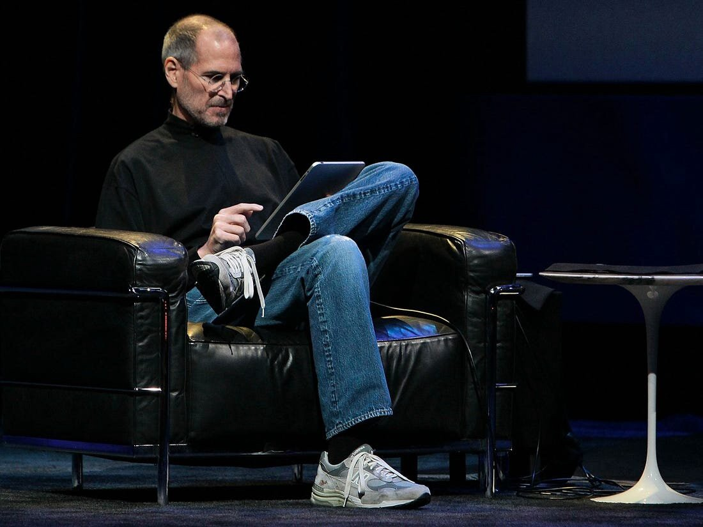

## 런업의 85점 패션 아이템 - 안경, 후드, 신발

### 01. 런업의 패션 원칙 : 85점을 맞춰라
패션에 점수를 매겨보자.
미니멀리즘이 스트릿보다 낫다는 게 아니라 얼마나 패션에 신경쓰느냐에 따른 점수다.
화려한 조명 아래 런웨이를 걷는 모델의 패션을 100점이다.
아무리 패션에 관심이 있는 런업일 지라도 40대 남성에게 과한 패션이다.
반대로 옷에 전혀 신경 쓰지 않고 그냥 잡히는 옷을 입는 사람은 아무리 좋아도 30점이다.
목이 늘어난 티에 무릎 나온 바지 역시 일반인의 영역에서 과하게 못하다. 

런업은 85이란 생각보다 애매한 점수를 자신의 기준으로 삼는다.
85점은 유행을 알지만 완전히 따라가지 않고 자신의 스타일 안에서 표현해내는 지점이다.
패션의 기본과 유행을 이해하는 점수가 80점에 그리고 자신만의 개성을 첨가하는 5점이 더해져 85점이 된다.

### 02. 85점 패션을 찾는 방법
#### 1. 기본 아이템이 중요하다
85점을 맞추기 전에 80점부터 맞춰야 한다. 첫 단계는 기본 아이템이다.
그러나 기본 아이템이라고 하더라도 생각보다 자신에게 딱 맞는 브랜드 아이템을 찾기는 쉬운 일이 아니다.
일차적으로 사람마다 체형이 다르기에 같은 옷을 입어도 핏이 다르다.
그리고 브랜드가 옷에서 추구하는 목표가 다르기 때문이다.

런업은 자신이 원하는 핏이 나오는 제품을 구매할 수 있는 눈을 길러야 한다고 말한다.
유행 따라 발렌시아가의 100만 원짜리 옷을 사느니 자잘하고 다양하게 투자하라 조언한다.
생지 청바지라도 자신에게 딱 맞는 옷을 입을 때 느낄 수 있는 쾌감이 있다.
다양한 시도 속에서 '아 이정도면 됐다.'는 느낌이 드는 옷을 찾을 수 있다.

남자의 패션의 완성도를 가늠할 수 있는 기본 아이템은 바지다.
상의나 신발과 달리 바지는 대부분 비슷하다.
청바지, 면바지 등 재질에 따른 여러 종류가 있지만 디자인은 크게 차이가 나지 않는다.
그래서 더 어렵다.
미묘한 차이에 따라 핏이 달라지기 때문이다.
같은 슬림 스트레이트라도 허벅지가 굵은 사람과 엉덩이가 부족한 사람을 위한 바지는 다르다.
40대 남자가 시도할 수 있는 바지는 세 종류가 있다.

##### 1. 슬림핏 팬츠
옛날에도 입었고 지금도 입고 앞으로도 입게 될 슬림핏이다.
패션을 위해 당연히 구비하고 있어야 하는 80점의 기본 아이템이다.
슬림핏의 경우 예뻐 보이기 위해 불편함을 감수할 필요는 없다.
나뿐만 아니라 보는 사람도 불편해질 수 있다.
밑위길이가 충분한 청바지는 슬림핏이라도 입기 편하다.
런업이 추천하는 슬림핏 청바지는 플랙(PLAC)의 KURZ 모델이다.
PLAC의 특징은 유행을 안타는 스타일과 호불호 없는 디자인을 고수한다는 점이다.
복숭아뼈까지 내려오는 핏으로 가볍지도 무겁지도 않은 슬림핏이 정석이다.

 
출처 : PLAC(https://plac-official.com/)

##### 2. 와이드핏 팬츠
재작년부터 유행한 와이드 핏은 런업의 기준에서는 과하지만 시도해봐야 하는 아이템이다.
유행을 이해하고 도전하는 것 또한 자신의 85점을 찾는 과정이기 때문이다. 
런업은 유행을 타는 아이템의 경우 저가에 구매하여 도전해보라고 말한다.
유행을 무조건적으로 따르는 것도 나쁘지만 유행에 대한 감을 키우는 것 역시 중요하다.
40대인 런업 역시 와이드핏 팬츠와 후드를 조합하여 편하고 감각적으로 코디했다.

##### 3. 레귤러핏 팬츠
스트레이트, 세미 와이드, 클래식 핏의 이름을 가진 바지계의 85점이다.
슬림핏은 무난하고 와이드핏은 과감하다면 레귤러핏은 산뜻하다.
유행에 민감하지만 유행만을 따르는 것은 아님을 보여줄 수 있는 바지다.
레귤러핏의 경우 잘못 입으면 벙해 보일 수 있다.
따라서 자신의 체형을 잘 알고 이에 적합한 브랜드를 선택해야 한다.
런업의 경우 아크네 스튜디오를 선택했다.
40만 원의 고가 제품이지만 투자할 가치가 있기 때문이다.

#### 2. 포인트 아이템
80점을 준비했다면 나머지 5점을 맞출 때다.
자신만의 스타일을 드러내는 코디로 이를 채울 수 있다.
또는 개성을 드러내는 포인트 아이템을 사용하는 것도 훌륭한 방법이다. 

자신의 개성을 패션에 담는 것에 익숙치 않을 수 있다.
이는 여러 시도를 통해 얻을 수 있는데 쉬운 일은 아니다.
시행착오의 과정에서 중요한 것은 편안함이다.
아이템을 사용할 때 자신이 편안하지 않다면 이는 당신에게 맞지 않는 것이 확실하다.

##### 안경 - Haffmans&Neumeister
런업은 시력이 좋지만 스타일의 톤앤매너에 맞춰 안경을 착용한다.
Haffmans&Neumeister는 독일 안경 브랜드로서 편안하면서도 개성을 드러낼 수 있는 안경을 만드는 곳이다.
창업자인 Haffmans 형제와 Jean-Pierre Neumeister는 아이웨어에서 20년이 넘는 경력을 갖추고 있다.
모든 공정은 베를린에서 진행된다.
브랜드는 첨단 기술을 사용한 편안한 디자인에 아방가르드한 미적 감각을 혼합하는 것을 추구한다.

#### 3. 때로는 과감하게 모험해라
85점은 아주 애매한 선이다.
거기서 조금 모자라면 사람이 밋밋해지고 조금만 더하면 부담스러워진다.
85점의 애매함은 사람이 은은하게 빛나는 지점이다.

정확한 지점을 알기 위해서는 때로는 모험도 필요하다.
다양한 시도를 해보고 거울 앞에 서서 자신을 바라본다.
과할 줄 알았던 아이템이 자신에게 인생템이 될지도 모른다. 런업의 꿀팁 : 과감한 아이템을 시도할 때는 혼자 집 앞에 나가보자.
모임에 나가기는 쪽팔릴 수도 있으니까.

##### 아디다스 X 프라다
런업은 아디다스 슈퍼스타의 팬이다.
아디다스 슈퍼스타는 1969년에 처음 발매됐다.
50년이 지난 지금도 Superstar 아디다스의 상징적인 라인으로 역할하고 있다.
슈퍼스타의 클래식함은 80점을 채우고도 남는다.

클래식의 대명사 슈퍼스타와 프라다가 콜라보를 진행한다.
2019년 프라다는 슈퍼스타 프라다를 선보였다.
프라다는 아디다스와의 두 번째 협업 아이템은 Luna Rossa 21이다. 
미래지향적인 디자인은 아디다스의 세 개의 라인 위에서 빛난다.
전통적을 따르면서도 혁신의 몫을 남기는 아이템이다. 
런업은 자신의 반골 기질에 따라 디올 조던보다 프라다 아디다스에 더 끌린다고 말한다.

#### 4. 진실되게 입자
어이없게 들릴 수 있지만 런업이 중요시하는 패션의 원칙 중 하나는 '진실하라'는 것이다.
패션은 자신을 나타내는 수단이다.
명품 시계, 차키 등 성공을 뽐내기 위한 패션은 티가 난다.
어설프게 패셔니스타인 척, 금수저인 척하면 자신에게 솔직하지 못하게 된다.
자신이 아닌 것을 가장하는 사람은 자신감이 없어 보인다.
이는 행동, 제스처, 눈빛으로 드러난다.
과장하지 않고 자신을 드러내는 사람은 쿨하다.

> "~인 척하는 순간 물건이 사람을 지배하게 됩니다. 멋있는 사람이 아니라 발렌시아가를 신는 사람이 돼요." _ 런업

##### 허쉘
런업에게 허쉘은 근-본이다.
유튜버로서 런업은 카메라, 마이크 등 챙겨야 할 장비가 많다.
가죽으로 된 멋진 브리프케이스는 런업의 것이 아니다.
그러나 그는 카메라맨은 아니다.
렌즈별로 나뉜 수납공간을 갖춘 카메라백은 그에게 과하다.

런업에게 필요한 것은 언제든 필요할 때면 지퍼를 열어 카메라를 쑤셔넣고 뛰어나갈 수 있는 백팩이다.
이런 의미에서 허쉘의 백팩은 그의 라이프스타일을 보여준다.
유튜버라는 직업 상 주목 받고 화려한 삶을 사는 것 같지만 보이지 않는 곳에 수많은 노력이 숨어 있다.
허쉘 백팩은 기스가 나더라도 그의 열정을 지켜주는 아이템이다.

### 03. 85점 시그니처 패션
'패션이 뭐가 중요해?'라고 말하는 사람도 있다.
스티브 잡스가 그 대표다.
그는 옷을 고를 시간을 최소화하기 위하여 매일 같은 옷을 입었다.
그러나 역설적이게도 사람들은 그를 생각하면 리바이스 청바지와 뉴발란스를 떠올린다.
잡스의 시그니처 아이템인 뉴발란스 992는 이번년 재발매되어 5분 만에 완판되기도 했다.
패션은 그 사람의 아이덴티티를 담는다.

패션에는 그 사람에 대한 많은 것이 드러난다. 
스웻셔츠와 후드를 즐겨 입는 40대 남성은 세상의 보편적인 기준에 신경쓰지 않는 사람일 것이다.
하는 일과 직장에 따라 착장과 태도가 달라진다.
디자이너나 에디터 등의 크리에이티브 분야의 사람에게 패션은 자신의 감각을 보여주는 1차 수단이다.
같은 크리에이트브 분야라도 웹 프로그래머라의 패션은 확인히 달라질 것이다. 

런업 채널에 자주 등장하는 포토그래퍼 랙강은 패션에서 편안함이 굉장히 중요하다.
좋은 사진을 찍기 위해 다양한 움직임을 만들어내야 하기 때문이다. 
동시에 아티스트로서의 면모도 보여줘야 할 필요가 있다.
그의 경우는 비니와 안경테, 신발의 컬러를 매치하여 포인트를 더한다.
물론 이 때도 작업할 때 편한 아이템이어야 한다.
포토그래퍼로서 작업의 효율성과 전문가의 태도를 놓치지 않는 그만의 시그니처 패션이다.

### 04. 85점, 세상과 나의 타협지점
85점 패션의 목적은 누구에게나 좋아보이는 패션을 찾는 것이 아니다.
자신만의 기준을 세우는 작업이다.
이를 위해 먼저 세상의 기준을 이해할 필요가 있다.
모두가 조던을 신을 때 자신의 취향을 따라 슈퍼스타를 신는 것은 멋진 일이다.
그러나 슈퍼스타가 아니라 나막신을 신는다면 그만큼 더 확고한 이유도 필요하다.

85점의 핵심은 세상의 기준인 80점을 채운 뒤 나머지 5점을 어떻게 채우느냐에 있다.
고작 5점일 뿐이지만 이는 개성을 드러내기에 충분하다.
개성은 모든 것을 깡그리 무시하고 내 마음대로 한다고 얻을 수 있는 게 아니기 때문이다.
자기자신을 세상의 기준에 맞춰 수정하고 다시 모험하고 피드백을 반영하는 과정에서 개성은 무르익는다.
인간은 틀이 주어져 있을 때 오히려 더 창의적이다[^1]. 
> 내 만트라 중 하나는 집중과 단순함이다. 단순해지는 것은 복잡한 것보다 훨씬 어렵다. 자신의 생각을 명확히 하고 단순화하기 위해서는 정말 많은 노력이 필요하다. _ 스티브 잡스

런업은 85를 모토로 배우고(Learn) 발전(Up) 하는 삶을 추구한다.
그의 초기 영상은 레전드 브이로거 케이시 나이스텟(Casey Neistet)의 포맷을 따른다.
그러나 갈수록 영상의 구도는 과괌해지고 백그라운드 음악은 섬세해진다.
브이로거로서 다양한 주제를 다루다가 패션 쪽으로 파고들어 브랜드 론칭을 꿈꿨다.
그러나 나이키 에센셜을 카피하는 부당한 방식으로 자신만의 브랜드를 만들려 했기에 실패하고 비난을 받았다.
배움이 없는 발전은 카피일 뿐이다.
그러나 피드백을 수용하고 자신만의 것으로 만드는 것은 창조다.
카피와 창조는 5점의 차이일 뿐이지만 거기엔 각고의 노력이 깃들어 있다. 유튜버 런업의 삶에 빗대어 보는 당신만의 85점은 무엇인가

[이어지는 글 : 런업과 케이시 나이스텟 - 모방과 창조](https://desarraigado.tistory.com/122)

***

[^1]: Sagiv, L., Arieli, S., Goldenberg, J. and Goldschmidt, A. (2010), Structure and freedom in creativity: The interplay between externally imposed structure and personal cognitive style. J. Organiz. Behav., 31: 1086-1110.