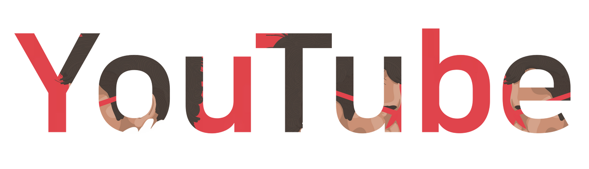
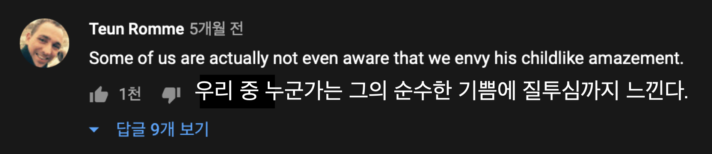

## 유튜브 분석 v1.0

>  외계인이 와서 인간에 대해 묻는다면 나는 유튜브를 보여주겠다.  _ 유튜브 문화트렌드 총괄책임자 케빈 알로카

유튜브에는 3천 7백만 개의 채널이 존재한다(2020년 11월 기준).
그리고 20억 명 이상의 사용자가 이를 시청한다.
100명 중 1.8 명은 자신의 채널에 영상을 올리고 공유한다.

내가 좋아하는 것을 공유하는 것은 즐거운 일이다.
유튜브에 자신이 좋아하는 것을 올리고 다른 사람들이 재밌어하길 바란다.
영상의 주제는 무엇이든 될 수 있다. 유튜브 최초의 동영상은 Jawed Karim(유튜브 초기 개발자 중 한 명)이 올린 '[Me at the Zoo](https://www.youtube.com/watch?v=jNQXAC9IVRw)'라는 18초 짜리 브이로그다.

유튜버로서의 가장 중요한 자질은 무엇일까.
획기적인 기획력? 유려한 말솜씨?
깔끔한 편집과 좋은 카메라는 좋은 동영상의 조건이지만 핵심적인 요소는 아니다.
요세미티 국립공원에 사는 Bear Vásquez가 촬영한 [두 개의 무지개 영상](https://www.youtube.com/watch?v=OQSNhk5ICTI)은 4,800만이 넘는 조회수를 기록했다. 이 영상을 특별하게 만든 것은 두 개의 무지개가 아니다.
영상에서 느껴지는 순수한 즐거움이다.

시청자가 유튜버에게 가장 바라는 것은 순수한 즐거움이다.
따라서 **유튜버는 자신이 좋아하는 것을 다른 사람과 공유하면서 기뻐하는 것을 업으로 삼는 사람**이다.
당신의 시선과 말, 어떤 것에 열광하고 슬퍼하는지, 그리고 그것을 왜 다른 이들과 나누고 싶어하는 지가 더 가치있다. 

유튜브를 통해 우리는 당신의 즐거움을 공유하길 바란다.
시청자로서 당신이 더 많이 기쁘고 그 즐거움을 우리와 나누길 바란다.
누가 와서 당신에 대해 묻는다면 나는 당신의 채널을 보여주겠다. 

***
#### 욕망 시리즈
1. [주다사 - 원초적인 행복에 대하여](https://desarraigado.tistory.com/115)
(주다사 플레이리스트 포스트 리디렉션, 스니펫 등록)
2. [먹방 - 원초적인 욕망에 대하여](https://desarraigado.tistory.com/136)
3. [유읽남 - 욕망의 가능성과 승리의 딜레마](https://desarraigado.tistory.com/105)
(죄수의 딜레마 게임으로 결론 확장 후 포맷 정리)

#### 셀프 브랜딩
1. [런업 - 자신만의 스타일](https://desarraigado.tistory.com/101)
(런업 아이템 포스트 리디렉션)
2. [런업 - 모방과 창조](https://desarraigado.tistory.com/122)
3. [자청 - 마케팅 성공신화](https://desarraigado.tistory.com/92?)
런업 - 셀프 브랜딩 [예정]

#### 인플루언서 마케팅
1. [넷플릭스 보건교사 안은영 - 인플루언서 마케팅 1](https://desarraigado.tistory.com/139)
(문단 단위 아닌 데이터 단위 읽기 쉬운 포맷으로 변경)
2. [유튜브 뒷광고 - 인플루언서 마케팅 2](https://desarraigado.tistory.com/141)
3. [승우아빠 - 인플루언서란](https://desarraigado.tistory.com/138)
(진행 중)

#### 유튜브 이슈
1. [가짜뉴스 - 유튜브와 확증편향성](https://desarraigado.tistory.com/100)
(문장 다이어트, 우파의 알고리즘 편향 논문 데이터 추가)
2. [보겸 - 유튜버와 구독자 간의 유사인간관계](https://desarraigado.tistory.com/108)
(유튜브 채널 데이터 보강, 유사인간관계 엮어 가조쿠 설명)
3. [사나고 - 유튜브 알고리즘과 참조틀](https://desarraigado.tistory.com/133)
(알고리즘 논문 내용 보강, 참조틀 벡터 내용 추가)

#### 유튜브 스토리
1. [이연 - 가볍고 작은 시작의 기술](https://desarraigado.tistory.com/102)
(읽기 편한 포맷으로 변경)
2. [히키코모리 - 유튜브로 히키코모리 극복하기](https://desarraigado.tistory.com/128)
(2인칭 시점 철학 내용 빼고 유사인간관계에 따른 이점 설명)
3. [임한올 - 좋아하는 것의 숭고함에 대하여](https://desarraigado.tistory.com/110)
(문단 나누고 읽기 편한 포맷으로 변경)
4. [알간지 - 조언하는 방법](https://desarraigado.tistory.com/114)
(설명글 -> 산문으로 포맷 변경)