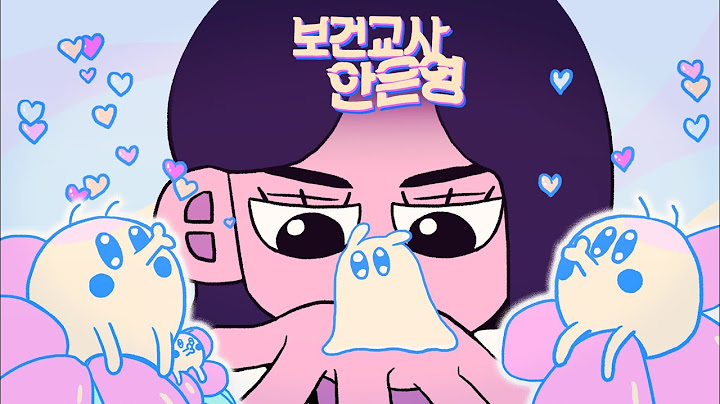
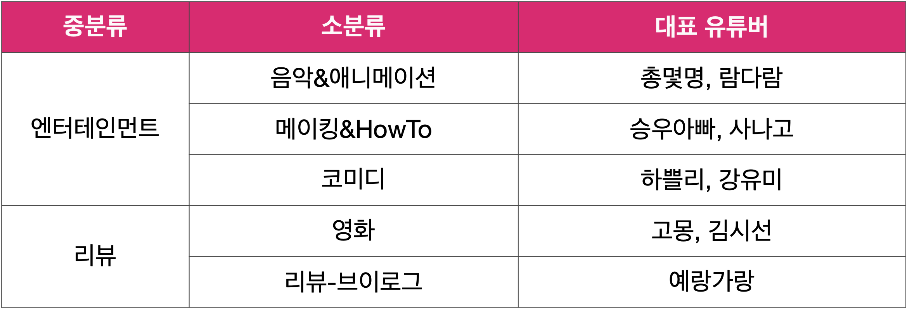
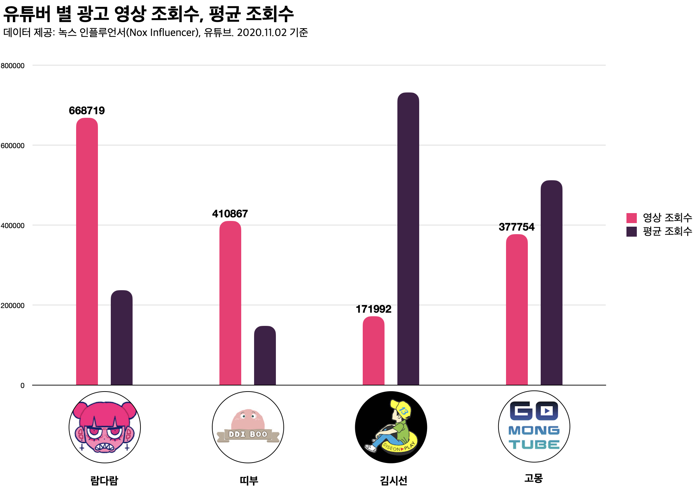
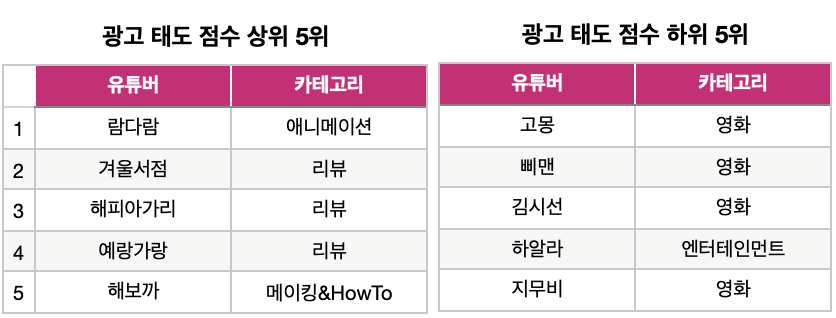
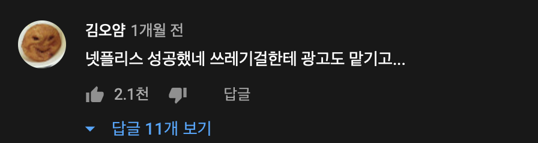
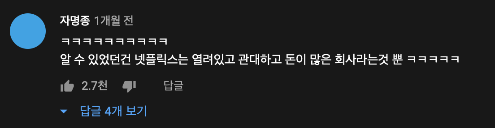

## 유튜브 바이럴 마케팅 사례 - 보건교사 안은영

유튜브 어딜가나 안은영의 얼굴이 나왔다.
넷플릭스 신작 ‘보건교사 안은영’은 신선한 컨셉의 판타지, 중독성 있는 OST, 깔끔한 CG 등 매력포인트를 가진 시리즈다.
넷플릭스는 홍보를 위해 여러 유튜버에게 광고를 맡겼다.
그런데 유튜버들은 ‘보건교사 안은영’을 소개하기보다 각자 자신의 콘텐츠로서 활용했다.
안은영 이야기는 안하고 시리즈에 나오는 젤리나 만들거나, 그러다 망치는 유튜버의 모습은 시청자에게 신선함으로 다가왔다. 

### 01. 넷플릭스 광고 성과
#### **데이터셋**
보건교사 안은영의 광고 영상 23개를 유튜브와 [녹스 인플루언서](https://kr.noxinfluencer.com)의 데이터를 이용하여 분석했다.
데이터는 구독자수, 광고 영상 조회수, 최근 30개 영상 평균 조회수, 댓글수, 좋아요수, 업로드 일자를 수집했다.
 *채널 ‘요주의 영화’ 는 구독자 수를 비공개하기에 분석 제외

구독자 수 채널의 구독자 수는 균일하게 분포되어 있었다.
사나고, 고몽 등 100만이 넘는 대형은 당연하거니와 넷플릭스는 10만 미만의 소형 유튜버까지 발굴하여 섭외했다.
업로드 날짜는 9월 15일~10월 10일의 기간에 업로드 됐으며 개봉일인 9월 25일부터 30일까지 절반인 12개의 영상이 올라왔다.
그 결과 유튜브 검색량이 눈에 띄게 증가했으며 9월 30일 최고치를 찍었다.

카테고리의 중분류는 ‘보건교사 안은영’의 정보를 전달하는 '리뷰' 카테고리와 이를 콘텐츠로 사용하는 '엔터테인먼트' 카테고리로 나눴다.
소분류는 영상 형식에 따라 나눴다.
리뷰 카테고리의 소분류는 시리즈를 영상으로 소개하는 '영화'와 대화 형식의 '리뷰-브이로그'가 있다.
엔터테인먼트의 소분류는 '메이킹&HowTo', '음악&애니메이션', '코미디'로 나눴다.
중분류의 리뷰와 엔터테인먼트가 각 12개 씩이었기에 넷플릭스가 카테고리를 고려하여 균형있게 유튜버를 선정했음을 알 수 있다.

#### 엔터테인먼트 카테고리
엔터테인먼트 카테고리는 '보건교사 안은영' 유튜브 광고의 핵심 파트다.
유튜브에 알맞는 광고 영상을 만들어 시청자에게 자연스럽게 광고를 전달할 수 있었다.
승우아빠, 사나고, 문에스더, 총몇명 등 대형 유튜버의 참여로 폭넓은 시청자 층을 만들었다.

메이킹&HowTo 카테고리의 영상은 '보건교사 안은영'의 상징인 젤리 메이킹 영상이다.
승우아빠, 사나고와 같은 대형 유튜버가 안은영을 콘텐츠로 사용하자 유튜브에서 이를 이용한 콘텐츠의 유행을 만들 수 있었다.
또한 광고 형식을 강요하지 않고 유튜버에게 높은 자유도를 보장하여 시청자가 자연스레 안은영에 관심을 갖도록 유도한다.

애니메이션&음악 카테고리에서 유튜버는 '보건교사 안은영'과 매우 좋은 시너지를 만들었다.
'보건교사 안은영'은 젤리CG와 중독성 강한 사운드에 큰 노력을 들인 시리즈다.
유튜버 람다람이 만든 '보건교사 안은영'의 레트로 애니메이션은 안은영의 아기자기한 색감을 잘 표현한 영상이다.
음악 유튜버 문에스더는 '이상하기로 소문난 OST [보건교사 안은영]'이란 제목에서부터 안은영의 독특한 매력포인트를 강조한다

#### 리뷰 카테고리
리뷰 카테고리는 광고 대상인 '보건교사 안은영'의 정보 전달에 집중한 전형적인 유튜버 협업 광고 형식이다.
영화 콘텐츠인 '보건교사 안은영'을 영화 유튜버가 광고하는 것은 매우 자연스러워 보이나 광고 성적은 매우 저조했다.

영화 카테고리의 광고 영상은 모두 채널의 평균 조회수를 넘지 못했다.
평균 구독자 수 967,000의 대형 유튜버가 많은 카테고리임에도 광고 도달률이 저조하다.
영상을 본 시청자의 광고 태도 수치 또한 매우 낮다.
좋아요수와 댓글수에 조회수를 나눈 값에서 하위 5위 중 4명이 영화 유튜버의 영상이다.

리뷰-브이로그 카테고리의 광고 영상은 시청자 광고 태도 수치가 높다.
둘 다 '보건교사 안은영'을 직접 다루지만 영화 콘텐츠는 소개, 중요 포인트 등 정보를 중심으로 한다.
반면 리뷰 콘텐츠는 시청자와 편하게 대화하는 형식으로 영화를 본 느낌, 감정에 대해 이야기한다.
감정을 중심으로 한 메세지 전달 방식은 유튜브에서 긍정적인 광고 태도를 이끌어내는 요인이다[^1].

### 02. 넷플릭스 광고 전략 분석
넷플릭스는 광고를 위해 유튜버를 섭외했지만 개입을 줄이고 자유도 높은 광고 영상을 만들었다.
이러한 전략으로 시청자의 긍정적인 콘텐츠 태도를 만들 수 있었다.
억지스러운 PPL이 아니기에 시청자는 광고를 즐길 수 있는 콘텐츠로 받아들인다.
광고 콘텐츠에 대한 긍정적인 태도는 제품 태도, 공유 의도, 구매 의도에 영향을 주는 요인이다[^2].
시청자가 콘텐츠를 즐기기만 하면 광고의 목적을 달성할 수 있다.

두 번째로 다양한 콘텐츠의 생산과 재생산이다
ASMR, 요리, 영화리뷰, 음악, 합성러 등 여러 유튜버는 광고에 개의치 않고 각자의 안은영을 만들었다.
유튜브에서 안은영은 광고가 아니라 하나의 유행으로 소모됐다.
이러한 흐름에 따라 광고 콘텐츠는 시청자에 의해 재생산되어 배포됐다.

그러나 다양한 광고 콘텐츠가 모두 광고 대상의 장점을 효과적으로 전달하는 건 아니다.
영화 카테고리의 광고 영상은 저조한 성적을 보였다.
'보건교사 안은영'의 가장 큰 장점은 현실 판타지라는 독특한 컨셉에 잘 어울리는 톡톡튀는 색감이다.
그럼에도 영화 카테고리의 유튜버는 모두 스토리를 중심으로 영상을 만들었다.
광고 대상의 매력을 정확히 잡아내지 못한 사례다.

또한 '보건교사 안은영'의 OST를 살리지 못한 점이 아쉽다.
유튜브에서 보건교사 안은영의 연관 키워드 중 OST는 해석, 젤리를 제치고 1위다.
보건교사 안은영에 대한 모든 영상에서 가장 높은 조회수는 일반인이 만든 보건교사 안은영 OST 영상이다(조회수 170만, 넷플릭스 공식 채널 영상 제외).
스토리만큼 독특한 안은영의 사운드는 밈으로 발전할 수 있었다.
패러디 춤을 추는 '퇴경아 약먹자', '핫바리' 등 흔히 병맛 유튜버라 불리는 이들과 협업하는 게 구독자수 200만이 넘는 사나고나 총몇명보다 더 좋은 광고효과를 냈을 것이다. 

### 03. 우리는 아무것도 하지 않는다. 안은영이 한다.
넷플릭스는 유튜버-인플루언서를 통한 마이럴 마케팅 전략을 사용했다.
전략에 따라 기획자는 의도적으로 **아무 것도 하지 않았다.**
다만 광고 대상인 안은영을 유튜브에 장난감으로 던졌을 뿐이다.
먼저 유튜버가 안은영을 갖고 콘텐츠를 만들었다.
이어 시청자에 의해 만들어진 다양한 안은영이 젤리처럼 증식했다.
어몽어스 안은영, 좀비 안은영, 글라스데코 안은영, 롤플레이 안은영이 우후죽순 등장했다.

'우린 아무것도 안한다' 전략의 첫 번째 이유는 **유튜브에서 가장 중요한 것은 재미이기 때문이다**.
누구나 영상을 만들 수 있기에 대단한 연예인이라도 특별취급 받지 않는다.
대기업에게도 예외는 없다.
대기업 광고라고 해도 재미가 없다면 시청자는 보지 않는다.

넷플릭스는 유튜버에게 재미를 맡겼다.
유튜버는 '대기업에서 광고!'라고 써붙이고선 자기 맘대로 콘텐츠를 만들었다.
시청자는 대기업 광고인데도 자신의 색깔을 유지하며 콘텐츠를 만드는 모습에 유튜버의 성공을 축하했다.
넷플릭스가 유튜버와 시청자는 넷플릭스가 깐 판에서 안은영이라는 장난감으로 재밌게 놀 수 있었다.  

두 번째 이유는 **유튜브에서 가장 중요한 것은 재미이기 때문이다**.
유튜브라는 놀이판에 자본이 끼어드는 것은 신중해야 하는 일이다.
만일 넷플릭스가 정해진 포맷을 갖고 대형 유튜버만을 집중 공략했다면 더 큰 바이럴을 만들 수 있었다.
그러나 자본이 크리에이터의 자유를 침해한다면, 쉽게 말해 돈 때문에 재밌는 영상 못만들게 만든다면, 크리에이터와 기업 모두의 이미지에 침해를 받는다.

재미는 진정성 있어야 한다.
요리 유튜버라면 영화 광고가 아니라 젤리를 만들고, 리믹스 매쉬업 유튜버라면 OST 리믹스를 만들어야 한다.
가짜로 만들어진 재미에 시청자는 민감하게 반응한다.
시청자의 입장에서 영화 유튜버가 만든 영화 광고는, 유튜버가 정말 안은영을 재밌다고 생각하더라도, 재미를 최우선으로 생각한 게 아니다.

넷플릭스 바이럴 마케팅 전략의 세 번째 이유는 **유튜브에서 가장 중요한 것은 재미이기 때문이다**.
그리고 넷플릭스는 즐길 줄 아는 기업의 이미지를 얻었다.
다시 말해, 노는데 용돈주는 좋은 형 정도? 물론 이 형이 원하는 게 뭔지는 알지만 재미만 있다면 굳이 신경쓰지 않는다.
유튜브 놀이판의 법칙은 하나다.
시청자를 재밌게 하기 위해서는 당신도 이 곳에서 재밌을 것. 당신이 즐기지 않는다면 누구도 즐기지 않는다.
안은영은 유튜브에서 재밌게 놀았다. 

***
[^1]: 선민재, 김준석, 나운봉. (2020). 미디어 플랫폼 유튜브 이용자의 광고 회의주의와 광고 회피 현상에 대한 고찰. 한국엔터테인먼트산업학회논문지, 14(6), 61-76
[^2]: 변혜민(Byeon, Hye Min), 심성욱(Shim, Sung Wook). (2020). 소셜미디어 플랫폼에 따른 인게이지먼트와 광고 인게이지먼트의 관계 : 인스타그램, 페이스북, 유튜브 비교를 중심으로. 광고PR실학연구, 13(2): 58-90

